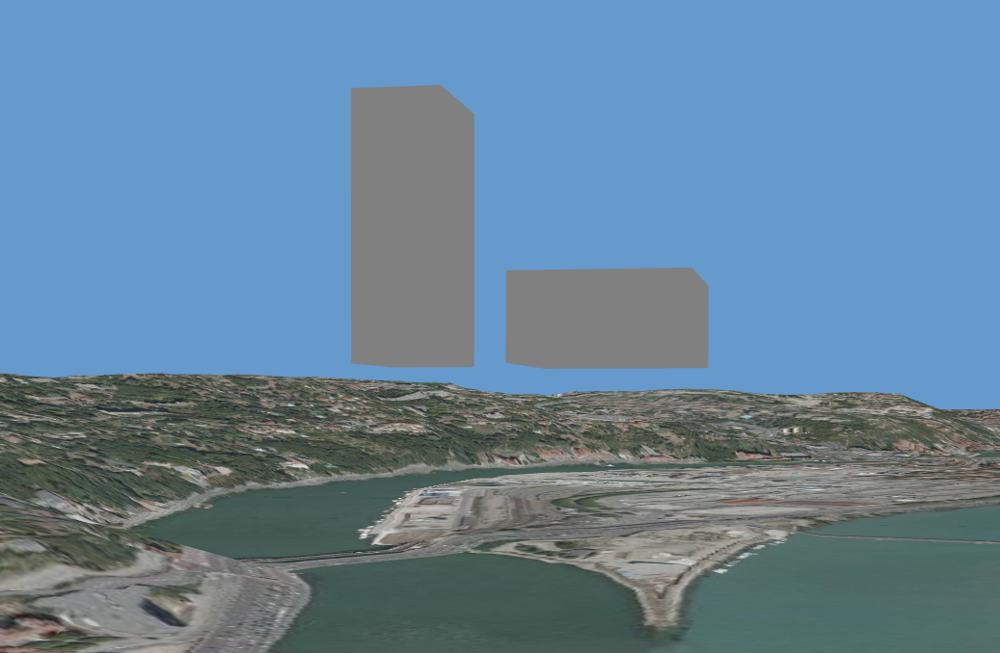

In order to generate this trivial tile set made of two cuboids
(without texture) you can use Py3dTiles (caveat emptor: requires the Tiler branch) with the following commands:
```
git clone -b Tiler git@github.com:VCityTeam/py3dtiles.git
cd py3dtiles/
virtualenv -p python3 venv
. venv/bin/activate
pip install -e .
pip install pytest pytest-benchmark
pytest -k "cube"
ls junk/
```
i.e. the resulting tile-set will be located in the junk subdirectory.

Here are the some visuals



