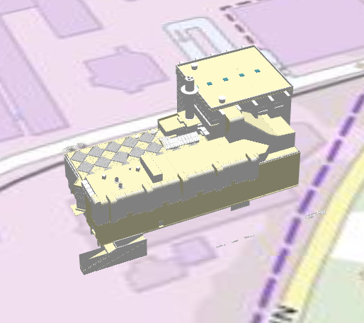
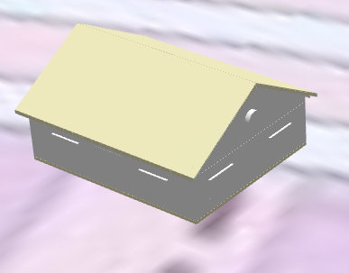

## A trivial tile set made of two cuboids

Refer [to the LyonTwoBuildingsNoTexture subdirectory](LyonTwoBuildingsNoTexture)

## 3DTiles colored by height

3D Tiles of the buildings of Lyon 1, colored by height.

To reproduce, refer to [this tutorial](https://github.com/VCityTeam/UD-Reproducibility/edit/master/Articles/2022_Py3DTilers/readme.md)

## Ifc_Doua

Created with [py3dtilers](https://github.com/VCityTeam/py3dtilers), from [this file](../Ifc/Chaufferie_doua.ifc) using this command :
`ifc-tiler --file_path chaufferie_doua.ifc --offset 0 0 -170`

## Ifc_FZK

Created with [py3dtilers](https://github.com/VCityTeam/py3dtilers), from [this file](../Ifc/AC20-FZK-Haus.ifc) using this command :
`ifc-tiler --file_path AC20-FZK-Haus.ifc --offset -1845700 -5177300 -170"`

