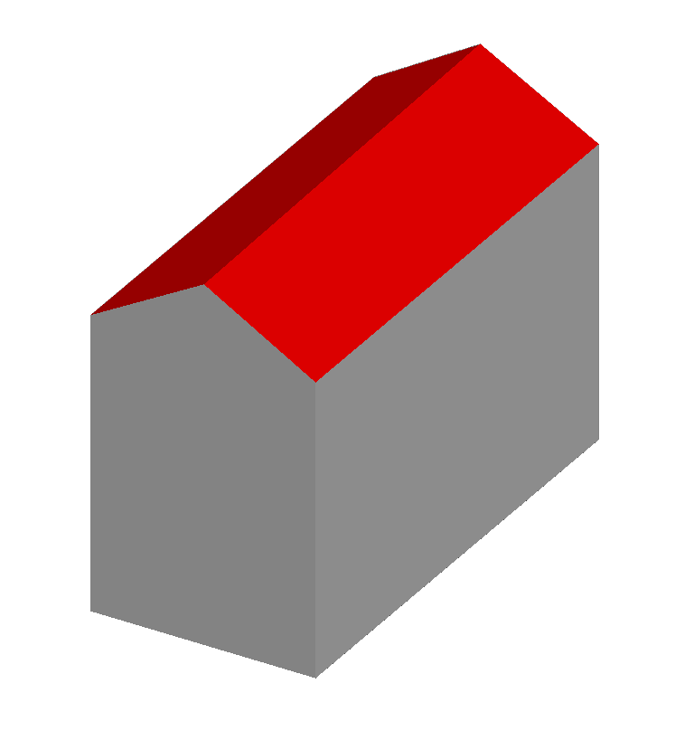
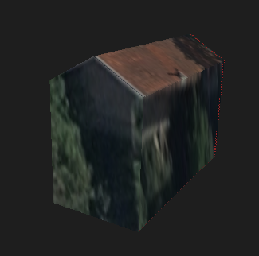
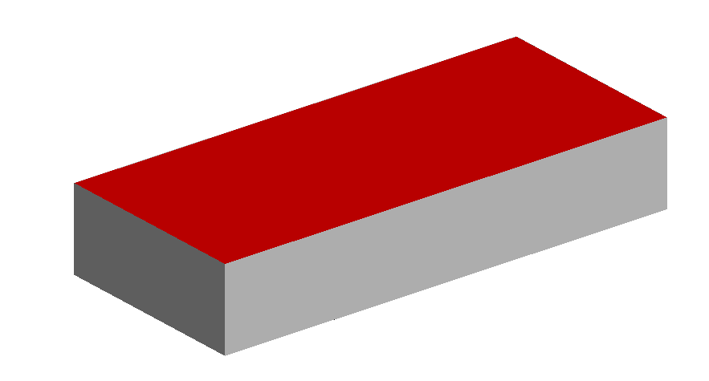
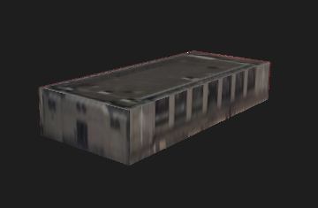
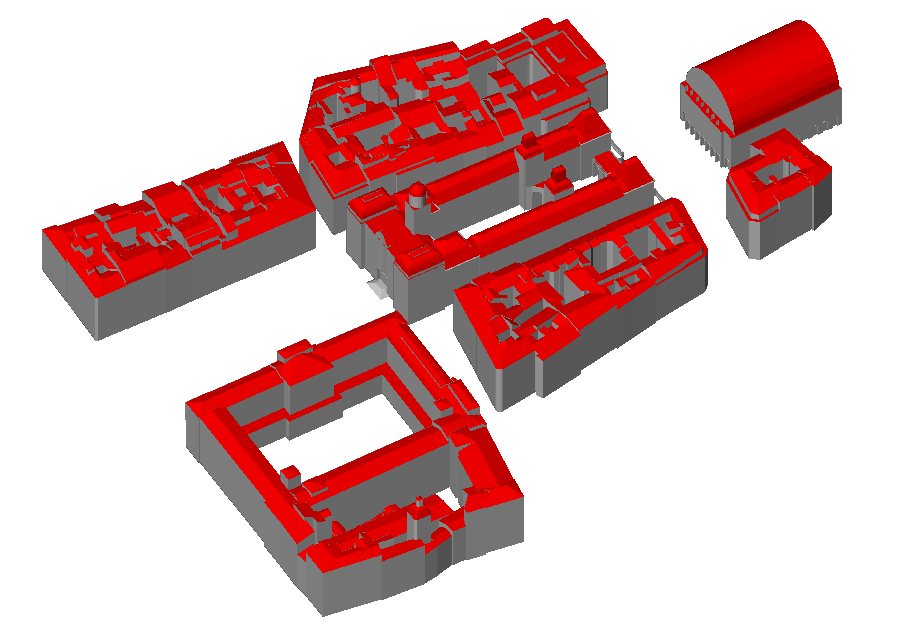
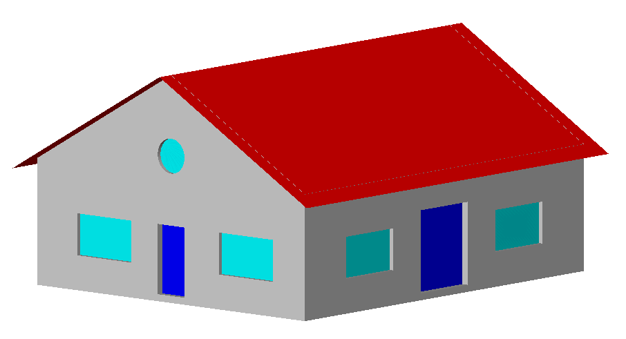

### Concerning the LYON_1ER_BATI_2015_small_house example




In order to retrieve the citygml file `LYON_1ER_BATI_2015_small_house.gml`
out of [Lyon open data](https://data.grandlyon.com/accueil)

- download the following archive
  ```
  wget https://download.data.grandlyon.com/files/grandlyon/localisation/bati3d/LYON_1ER_2015.zip
  unzip LYON_1ER_2015.zip
  ```

- With your favorite (robust) editor, edit `LYON_1ER_2015/LYON_1ER_BATI_2015.gml`
   and keep the `cityObjectMember` xml tag which has the `gml:id` of value `BU_69381AB133`
   (i.e. the `cityObjectMember`with the line `<bldg:Building gml:id="BU_69381AB133">`) 
   while removing all the other `cityObjectMember` entries.

- Rename the `app:imageURI` entry within the 
  `<app:Appearance> <app:surfaceDataMember><app:ParameterizedTexture>` tag i.e. you should
  get something like
  ```
  <app:Appearance>
      <app:theme>RhinoCity ObliqueTexturing</app:theme>
      <app:surfaceDataMember>
         <app:ParameterizedTexture>
             <app:imageURI>LYON_1ER_BATI_2015_small_house.jpg</app:imageURI>
         ...
  ```

- Copy and rename the appearance texture accordingly i.e.
  ```
  cp LYON_1ER_2015/LYON_1ER_BATI_2015_Appearance/69381AB133.jpg ./LYON_1ER_BATI_2015_small_house.jpg
  ```

### Concerning the LYON_2EME_BATI_2015_small_house example




### Lyon Hôtel de Ville datasets



[This folder](./LYON_1ER_BATI_2009-2018_hotel_de_ville) contains 4 small datasets created using the method proposed [in the previous section](#Concerning-the-LYON_1ER_BATI_2015_small_house-example) but without any texture or appearance data. These datasets feature several remarkable buildings around the [Hôtel de Ville](https://en.wikipedia.org/wiki/H%C3%B4tel_de_Ville,_Lyon) of Lyon, France from 2009-2018.

These datasets in CityGML 3.0 can be found [here](../CityGMLv3.0).


### FZKHaus Example



This is a simple non textured CityGML 2.0 example a house, taken from the [tum-gis/citygml2-to-citygml3](https://github.com/tum-gis/citygml2-to-citygml3/tree/master/input) Github repository.
A version of this file in CityGML 3.0 is also located in the [OGC CityGML 3.0 Encoding Github](https://github.com/opengeospatial/CityGML-3.0Encodings/tree/master/CityGML/Examples/Building) alongside several other examples.
