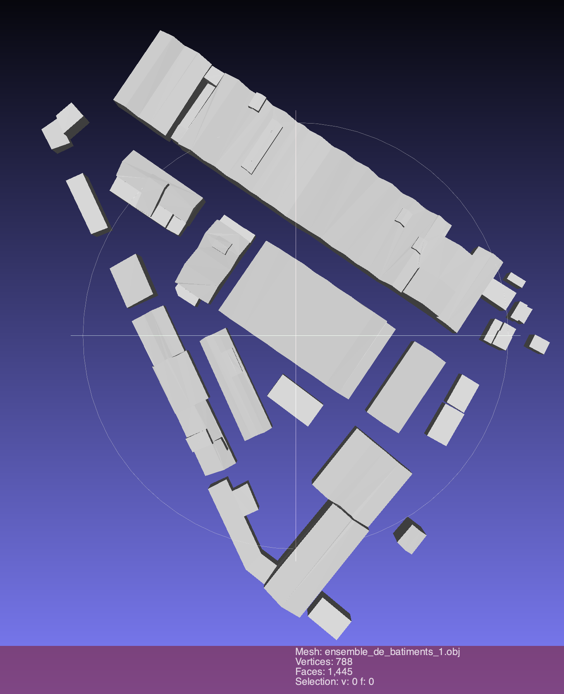
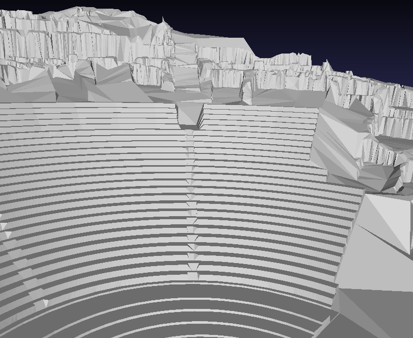

# OBJs

Use the branch [filter_ids](https://github.com/VCityTeam/py3dtilers/tree/filter_ids) of py3dtilers to target the CityObjects.

```bash
citygml-tiler --type <type> --obj <output_obj_name> --ids <cityobject_ids>
```

Example:

```bash
citygml-tiler --type building --obj tour_part_dieu --ids 69383AR8
```

## Part Dieu tower building


* Problem: missing surfaces (after py3dTilers treatment)
* [Obj file](tour_part_dieu.obj)
* source: [maquette texturée 2018](https://data.grandlyon.com/jeux-de-donnees/maquettes-3d-texturees-2018-communes-metropole-lyon/info)  
* cityobject_id: 69383AR8  
* CityGML type: building

## Palais de justice


* Problem: missing surfaces (after py3dTilers treatment)
* [Obj file](palais_de_justice.obj)
* source: [maquette texturée 2018](https://data.grandlyon.com/jeux-de-donnees/maquettes-3d-texturees-2018-communes-metropole-lyon/info)  
* cityobject_id: 69385AH128  
* CityGML type: building

## Charity hospital bell tower


* Problem: missing surfaces (after py3dTilers treatment) and also two
  geometrical buildings in one logical descriptor (refer below for details)
* [Obj file](cloche_hopital_charite.obj)
* Source: [maquette texturée 2018](https://data.grandlyon.com/jeux-de-donnees/maquettes-3d-texturees-2018-communes-metropole-lyon/info)
* cityobject_id: 69382PUBLIC10  
* CityGML type: building

## Building set 1



* Problem: two geometrically distinct buildings erroneously regrouped in
  a single logical descriptor
* [Fichier obj](ensemble_de_batiments_1.obj)
* source: [maquette texturée 2018](https://data.grandlyon.com/jeux-de-donnees/maquettes-3d-texturees-2018-communes-metropole-lyon/info)
* cityobject_id: 69388CI75
* CityGML type: building  

## Building set 2


* Problem: two geometrically distinct buildings erroneously regrouped in
  a single logical descriptor
* [Obj file](ensemble_de_batiments_2.obj)
* source: [maquette texturée 2018](https://data.grandlyon.com/jeux-de-donnees/maquettes-3d-texturees-2018-communes-metropole-lyon/info)  
cityobject_id: 69388AW117  
* CityGML type: building  

## Building set 3


* Problem: two geometrically distinct buildings erroneously regrouped in
  a single logical descriptor triggers a scale fusing algorithm two go off
  the charts
* [Obj file](cloche_hopital_charite.obj)
* Source: [maquette texturée 2018](https://data.grandlyon.com/jeux-de-donnees/maquettes-3d-texturees-2018-communes-metropole-lyon/info)
* cityobject_id: 69382PUBLIC10  
* CityGML type: building

## Terrain extract 1 (lyon_5)

Data before treatment



Data after treatment


* Problem: inverted normals and missing surfaces/triangles
* [Obj file](extrait_1_terrain_lyon_5_pre_py3dtilers.obj)
* Source: [maquette texturée 2018](https://data.grandlyon.com/jeux-de-donnees/maquettes-3d-texturees-2018-communes-metropole-lyon/info)  
* cityobject_id: gml_af20ae56-d662-4581-b17f-e7ca01101e3e  
* CityGML type: relief  

## Terrain extract 2 (lyon_5)


* Problem: inverted normals. Too many (degenerated) triangles. Too many
  vertices not providing geometrical information.
* [Obj file](extrait_2_terrain_lyon_5.obj)
* Source: [maquette texturée 2018](https://data.grandlyon.com/jeux-de-donnees/maquettes-3d-texturees-2018-communes-metropole-lyon/info)  
* cityobject_id: gml_38179d6d-9886-48a9-9634-4e5eb1016a06  
* CityGML type: relief  

## Terrain extract 3 (lyon_2)


* Problem: inverted normals. Too many (degenerated) triangles. Too many
  vertices not providing geometrical information.
* Source: [maquette texturée 2018](https://data.grandlyon.com/jeux-de-donnees/maquettes-3d-texturees-2018-communes-metropole-lyon/info)  
* cityobject_id: gml_f61667a0-435c-4d2f-973b-8b6d916fa9f9  
* CityGML type: relief  

## Building the 3dCityDB for running the tiler

References are 

* [docker usage of 3dCityDB](https://3dcitydb-docs.readthedocs.io/en/latest/3dcitydb/docker.html#usage-and-configuration)
* [docker usage of importer/exporter](https://3dcitydb-docs.readthedocs.io/en/latest/impexp/docker.html)

```bash
# Download the data
wget https://download.data.grandlyon.com/files/grandlyon/imagerie/2018/maquette/LYON_2EME_2018.zip
unzip LYON_2EME_2018.zip
# Start the 3dCity data base
docker network create citydb-net
docker run --name citydbTemp -p 5432:5432 -dt --network citydb-net -e "CITYDBNAME=citydb" -e "SRID=3946" -e "GMLSRSNAME=espg:3946" -e "POSTGRES_USER=postgres" -e "POSTGRES_PASSWORD=postgres" 3dcitydb/3dcitydb-pg
# Import the data
docker run --rm --name 3dcitydb-impexp -t --network citydb-net -e CITYDB_TYPE=postgresql -v $(pwd):/data 3dcitydb/impexp import -H citydbTemp -d postgres -u postgres -p postgres /data/LYON_2EME_2018/LYON_2EME_BATI_2018.gml
# Assert the importation ran smoothly
export PGPASSWORD=postgres
query='SELECT COUNT(*) FROM citydb.cityobject;'
psql -h localhost -p 5432 -U postgres -d postgres -c "$query"
# Extract a specific building (out of its 69382PUBLIC10 id)
docker run -i -t --rm --name impexp --network citydb-net -v $(pwd):/data 3dcitydb/impexp export-vis -H citydbTemp -d postgres -u postgres -p postgres -i 69382PUBLIC10 -l 2 -D collada -G --gltf-binary -o /data/result_building_glTf.kml
```
